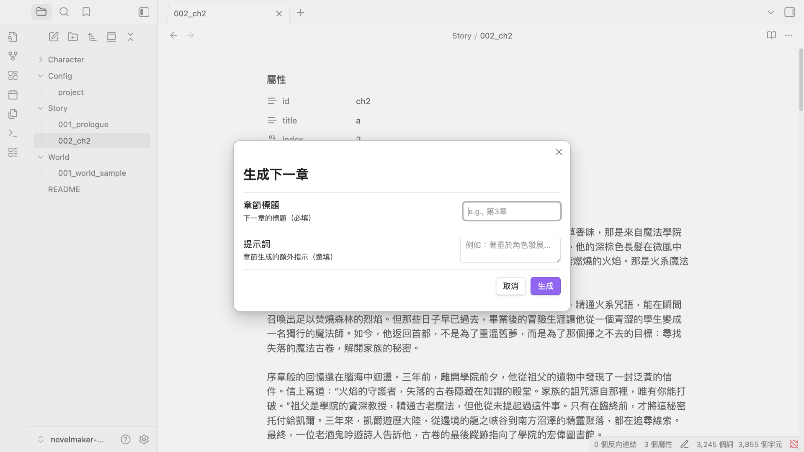

# gonovelmaker

[](https://goreportcard.com/report/github.com/voilelab/gonovelmaker)

一個用於管理 Obsidian vault 中小說專案的命令列工具，整合 OpenAI 功能。
目前專注於生成中文小說，所以預設模板和範例均為中文內容。



## 功能特色

- 初始化結構化的 Obsidian vault 小說專案
- 掃描和分析現有專案結構（支援 JSON 格式輸出）
- 使用 OpenAI GPT 模型生成章節
- 使用 OpenAI GPT 模型生成角色檔案
- 組織角色（Character/）、世界觀（World/）和故事章節（Story/）
- 支援 YAML frontmatter 元數據
- 自訂提示詞模板系統

## 技術棧

- **Go** 1.25.4 或更高版本
- **OpenAI API** 整合（使用 openai-go/v3）
- **Cobra** CLI 框架
- **go-toml** 配置管理

## 開始使用

### 先決條件

- Go 1.25.4 或更高版本
- OpenAI API 金鑰（用於章節生成）

### 安裝

```bash
go install github.com/voilelab/gonovelmaker/cmd/novelmaker-obs@latest
```

## 設定

在 `~/.novelmaker/config.toml` 建立設定檔：

```toml
openai_api_key = "sk-xxx"
model = "gpt-4o"
base_url = ""  # 可選：自訂 OpenAI API 端點
```

**設定選項：**
- `openai_api_key` - 您的 OpenAI API 金鑰（`gen-next` 和 `gen-char` 命令必需）
- `model` - 要使用的 OpenAI 模型（可選，預設為 `gpt-4o`）
- `base_url` - 自訂 OpenAI API 端點（可選，可用於相容 OpenAI API 的第三方服務）

首次執行工具時，如果設定檔不存在，會自動在 `~/.novelmaker/` 建立範例設定檔。

您也可以透過環境變數設定 API 金鑰：
```bash
export OPENAI_API_KEY=sk-xxx
export OPENAI_BASE_URL=https://api.example.com/v1  # 選用
```

## CLI 使用方式

### 初始化新的小說專案

```bash
novelmaker-obs init
```

在當前目錄建立小說專案結構，包括：
- `Config/project.md` - 專案設定檔
- `World/001_world_sample.md` - 世界觀範例
- `Character/character_sample.md` - 角色範例
- `Story/001_prologue.md` - 故事章節範例
- `README.md` - 專案說明
- `.obsidian/app.json` - Obsidian 設定

### 掃描現有專案結構

```bash
novelmaker-obs scan
```

掃描並顯示專案資訊，包括專案配置、世界觀條目、角色、章節等。

以 JSON 格式輸出（方便程式化處理）：
```bash
novelmaker-obs scan --json
```

### 生成下一章節

```bash
novelmaker-obs gen-next --title "第2章：旅程開始"
```

基於現有專案內容（世界觀、角色、前面章節）生成新章節。

參數說明：
- `-t, --title` - 目標章節標題（必需）
- `-p, --prompt` - 自訂生成提示詞（選用，預設使用範本）

### 生成新角色

```bash
novelmaker-obs gen-char --prompt "一個神秘的魔法師，擅長時間魔法"
```

基於專案背景和提示詞生成角色檔案。

指定角色名稱：
```bash
novelmaker-obs gen-char --prompt "路人甲" --name "路人甲"
```

參數說明：
- `-p, --prompt` - 角色描述/生成提示（必需）
- `-n, --name` - 角色名稱（選用，未提供時會從 AI 回應中提取）

### 重新生成現有角色

```bash
novelmaker-obs gen-char-curr --filepath "Character/alice.md"
```

基於角色檔案中儲存的提示詞（`prompt` frontmatter 欄位）重新生成角色描述。

參數說明：
- `-f, --filepath` - 角色檔案路徑（相對於 vault 根目錄，必需）
- `-j, --json` - 以 JSON 格式輸出結果（選用）

### 自訂提示詞模板

工具載入時會自動在 `~/.novelmaker/templates/` 建立預設提示詞模板：
- `chapter_prompt.tmpl` - 章節生成提示詞模板
- `character_prompt.tmpl` - 角色生成提示詞模板

您可以直接編輯這些模板檔案來自訂 AI 生成內容的方式。模板使用 Go template 語法，支援：
- 條件判斷：`{{if .Condition}}...{{end}}`
- 迴圈：`{{range .Items}}...{{end}}`
- 變數：`{{.ProjectName}}`, `{{.World}}`, `{{.Title}}` 等
- 自訂函數：`{{join .Tags ","}}`

模板可用的資料欄位請參考內建模板內容。

## 專案結構

### 程式碼結構

```
gonovelmaker/
├── cmd/novelmaker-obs/          # CLI 主程式
│   ├── main.go                  # 命令列介面實作
│   └── init_template/           # 專案初始化範本
│       ├── Config/
│       │   └── project.md
│       ├── World/
│       │   └── 001_world_sample.md
│       ├── Character/
│       │   └── character_sample.md
│       ├── Story/
│       │   └── 001_prologue.md
│       ├── .obsidian/
│       │   └── app.json
│       └── README.md
├── internal/
│   ├── config/                  # 設定管理
│   │   ├── config.go            # 設定載入器
│   │   ├── prompt_templates.go  # 提示詞範本管理
│   │   ├── example_config.toml
│   │   └── templates/           # 內建提示詞範本
│   │       ├── chapter_prompt.tmpl
│   │       └── character_prompt.tmpl
│   └── obsidian/                # Obsidian vault 處理
│       ├── loader.go            # vault 載入器
│       ├── vault.go             # 專案資料結構
│       └── frontmatter.go       # YAML frontmatter 解析器
├── novelmaker/                  # 核心生成邏輯
│   └── app.go                   # OpenAI API 整合與生成器
├── go.mod
└── README.md
```

### Obsidian Vault 結構

當您使用 `novelmaker-obs init` 初始化專案時，會建立：

```
your-novel-project/
├── Config/
│   └── project.md               # 專案設定（含 frontmatter）
│       # 欄位：id, name, world, system_prompt, system_prompt_char
├── World/
│   └── *.md                     # 世界觀條目（含 tags）
├── Character/
│   └── *.md                     # 角色檔案（含 name, main 等）
├── Story/
│   └── *.md                     # 故事章節（含 index, title 等）
├── .obsidian/
│   └── app.json                 # Obsidian 編輯器設定
└── README.md                    # 專案說明文件
```

所有 Markdown 檔案都使用 YAML frontmatter 儲存結構化元數據，方便工具解析和 Obsidian 顯示。

## 開發說明

### 依賴套件

- `github.com/openai/openai-go/v3` - OpenAI API 客戶端
- `github.com/spf13/cobra` - CLI 框架
- `github.com/pelletier/go-toml/v2` - TOML 設定解析
- `gopkg.in/yaml.v3` - YAML frontmatter 解析

### 建置

```bash
go build ./cmd/novelmaker-obs
```

### 執行測試

```bash
go test ./...
```

## 常見問題

**Q: 如何更換 OpenAI 模型？**  
A: 在 `~/.novelmaker/config.toml` 中設定 `model` 欄位，例如 `model = "gpt-4o-mini"` 或 `model = "gpt-4"`。

**Q: 可以使用其他相容 OpenAI API 的服務嗎？**  
A: 可以，設定 `base_url` 欄位指向第三方服務端點，例如 Azure OpenAI 或其他本地部署的模型服務。

**Q: 生成的內容會自動加入專案嗎？**  
A: 是的，`gen-next` 和 `gen-char` 命令會自動建立對應的 Markdown 檔案並加入適當的 frontmatter。

**Q: 如何自訂生成的章節或角色格式？**  
A: 編輯 `~/.novelmaker/templates/` 中的提示詞範本檔案，調整提示詞內容和格式。

## 授權（License）

本專案 NovelMaker Core / CLI 以 BSD 3-Clause License（3 條款 BSD 授權） 釋出。
您可以自由使用、修改、重製與散布本專案的核心程式碼，
也可將其整合進您自己的專案（包含商業用途）。

### 此授權適用的範圍

BSD-3 授權 僅適用於本版本庫中的：

* 核心程式碼（cmd/, internal/, novelmaker/）
* 基礎範例與範本（cmd/novelmaker-obs/templates/）
* 設定檔格式與範例（internal/config/example_config.toml）
* 內建提示詞範本（internal/config/templates/）

以上內容均可依 BSD-3 使用，包含商用、重製與二次散布。

### 不包含在開源授權範圍內的內容

以下類型的內容並未包含於 BSD-3 授權範圍內，仍保留原作者完整權利：

* 作者實際使用的寫作提示語（Prompts）
* 任何 世界書（Worldbook）包含角色設定、劇情資料、背景知識、概念文檔等
* Obsidian Vault 或其他形式的小說原文、草稿、章節規劃

除非另行以書面方式授權，以上內容均不得視為本專案的開源部分。
