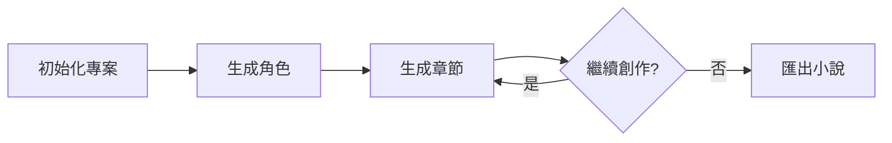

# CLI 概覽

gonovelmaker 提供強大的命令列介面（CLI），讓您能夠高效管理小說專案、生成內容和匯出成果。

## 設計理念

CLI 工具設計遵循以下原則：

- 🎯 **直觀易用**：命令名稱清晰明瞭，參數設計合理
- 🔄 **工作流導向**：支援完整的創作工作流程
- 📊 **結構化輸出**：支援 JSON 格式，便於整合與自動化
- 🔧 **靈活配置**：支援設定檔、環境變數和命令列參數

## 基本用法

```bash
novelmaker-obs [command] [flags]
```

查看所有可用命令：

```bash
novelmaker-obs --help
```

查看特定命令的說明：

```bash
novelmaker-obs [command] --help
```

## 命令分類

### 專案管理

初始化和管理小說專案結構：

| 命令 | 功能 | 用途 |
|------|------|------|
| `init` | 初始化專案 | 建立新的小說專案結構 |
| `scan` | 掃描專案 | 分析現有專案內容 |
| `config-check` | 檢查設定 | 驗證設定檔是否正確 |

### 內容生成

使用 AI 生成小說內容：

| 命令 | 功能 | 用途 |
|------|------|------|
| `gen-next` | 生成下一章節 | 基於現有內容生成新章節 |
| `gen-curr` | 重新生成章節 | 重新生成現有章節 |
| `gen-next-empty` | 建立空白章節 | 建立章節範本供手動撰寫 |
| `gen-char` | 生成角色 | 建立新的角色檔案 |
| `gen-char-curr` | 重新生成角色 | 更新現有角色描述 |
| `gen-char-img` | 生成角色圖片 | 使用 DALL-E 生成角色圖像 |

### 匯出與外掛

匯出內容和管理外掛：

| 命令 | 功能 | 用途 |
|------|------|------|
| `export` | 匯出小說 | 將完整小說匯出為文字檔 |
| `update-plugin` | 更新外掛 | 更新 Obsidian Novel Maker 外掛 |

## 通用參數

### 全域旗標

這些旗標可用於所有命令：

| 旗標 | 簡寫 | 說明 | 預設值 |
|------|------|------|--------|
| `--help` | `-h` | 顯示命令說明 | - |
| `--version` | `-v` | 顯示版本資訊 | - |

### 常用旗標

某些命令共用的旗標：

| 旗標 | 簡寫 | 說明 | 適用命令 |
|------|------|------|----------|
| `--json` | `-j` | 輸出 JSON 格式 | scan, gen-* |
| `--api-key` | - | 覆蓋 API 金鑰 | gen-* |
| `--base-url` | - | 覆蓋 API 端點 | gen-* |
| `--model` | - | 覆蓋文字模型 | gen-* |
| `--timeout` | - | 設定 API 超時 | gen-* |

## 工作流程

### 典型創作流程



### 命令使用順序

1. **初始化專案**
   ```bash
   novelmaker-obs init
   ```

2. **建立世界觀和角色**
   ```bash
   novelmaker-obs gen-char --prompt "主角設定"
   ```

3. **生成章節**
   ```bash
   novelmaker-obs gen-next --title "第一章"
   ```

4. **檢視專案狀態**
   ```bash
   novelmaker-obs scan
   ```

5. **匯出成果**
   ```bash
   novelmaker-obs export --output novel.txt --type txt
   ```

## 輸出格式

### 標準輸出

預設情況下，命令會以人類可讀的格式輸出：

```
✅ 專案初始化成功！
📁 專案路徑: /path/to/your/vault
📖 已建立範例檔案：
  - Config/project.md
  - Character/character_sample.md
  - Story/001_prologue.md
```

### JSON 輸出

使用 `--json` 旗標取得結構化輸出：

```json
{
  "success": true,
  "project_path": "/path/to/your/vault",
  "files_created": [
    "Config/project.md",
    "Character/character_sample.md",
    "Story/001_prologue.md"
  ]
}
```

!!! tip "自動化整合"
    JSON 輸出非常適合整合到 CI/CD 流程或自訂腳本中。

## 錯誤處理

### 錯誤訊息

當命令執行失敗時，會顯示清晰的錯誤訊息：

```
❌ 錯誤：找不到專案設定檔
提示：請先執行 'novelmaker-obs init' 初始化專案
```

### 返回碼

| 返回碼 | 意義 |
|--------|------|
| `0` | 成功 |
| `1` | 一般錯誤 |
| `2` | 設定錯誤 |
| `3` | API 錯誤 |

在腳本中使用：

```bash
if novelmaker-obs scan; then
  echo "專案掃描成功"
else
  echo "專案掃描失敗，返回碼：$?"
fi
```

## 設定優先順序

當多個來源提供相同設定時，優先順序為：

1. **命令列參數**（最高優先）
2. **環境變數**
3. **設定檔** (`~/.novelmaker/config.toml`)
4. **預設值**（最低優先）

範例：

```bash
# 設定檔中設定 model = "gpt-4o"
# 但命令列覆蓋為 gpt-4o-mini
novelmaker-obs gen-next --title "測試" --model gpt-4o-mini
```

## 效能考量

### 批次操作

對於大量操作，建議：

1. 使用 `--json` 輸出便於解析
2. 適當設定 `--timeout` 避免長時間等待
3. 考慮使用腳本自動化重複任務

### API 用量優化

- 使用 `gen-next-empty` 建立草稿，手動編輯後再生成
- 調整 `--prev-chapters` 參數控制上下文大小
- 使用較小的模型（如 gpt-4o-mini）進行測試

## 下一步

- 📚 [命令參考](commands.md) - 查看所有命令的詳細說明
- 💡 [使用範例](examples.md) - 學習實際使用案例
- 🏗️ [世界書結構](../worldbook/schema.md) - 了解檔案組織方式
