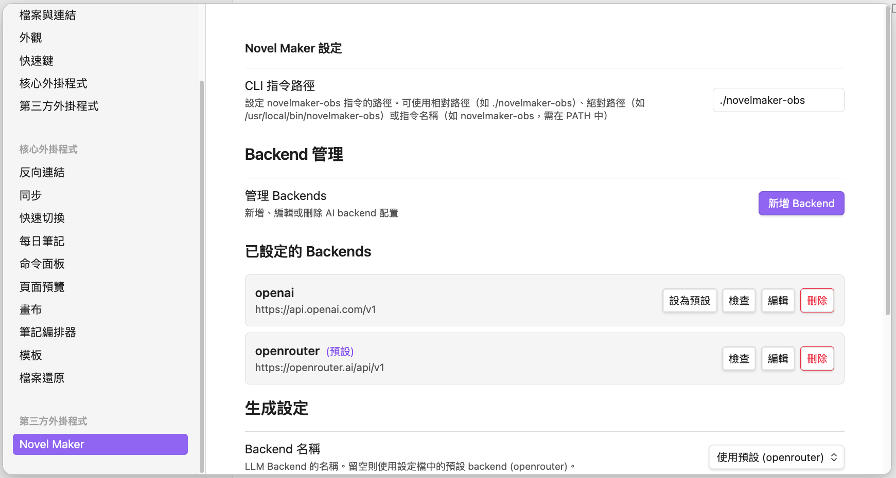

# Obsidian Novel Maker 外掛

Novel Maker 是專為 gonovelmaker 設計的 Obsidian 外掛，提供圖形化介面來管理和創作小說專案。

## 功能概覽

- 🎨 **直覺介面**：在 Obsidian 中直接操作 gonovelmaker 功能
- 🔄 **即時同步**：與 CLI 工具完全相容
- 📝 **編輯增強**：提供寫作輔助功能
- 🎯 **快速操作**：命令面板整合
- 📊 **專案視圖**：視覺化專案結構

## 安裝外掛

在 `novelmaker-obs init` 時會自動安裝 Obsidian 外掛到您的 vault 中。

## 啟用外掛

1. 開啟 Obsidian
2. 前往 **Settings**（設定）
3. 選擇 **Community plugins**（社群外掛）
4. 關閉 **Safe mode**（安全模式，首次使用時）
5. 點擊 **Browse**（瀏覽）
6. 在已安裝外掛列表中找到 **Novel Maker**
7. 點擊開關啟用

!!! warning "安全模式"
    首次使用社群外掛時需要關閉安全模式。Novel Maker 是本地外掛，除了 LLM API 請求外不會傳送任何資料到外部伺服器。

## 使用介面

### 側邊欄視圖

外掛提供專用的側邊欄視圖：

1. 點擊左側邊欄的書本圖示 📚
2. 或使用命令面板：`Ctrl/Cmd + P` → 輸入 "Novel Maker: Open view"

**視圖內容：**

```
📚 小說專案管理

專案資訊
  名稱：魔法學院編年史
  世界：艾瑟利亞大陸
  章節：15

快速操作
  [生成新章節]
  [生成新角色]
  [匯出小說]
  [專案掃描]

最近章節
  ✏️ 第15章：決戰前夕
  ✅ 第14章：秘密揭曉
  ✅ 第13章：陰謀浮現
```

### 命令面板

按 `Ctrl/Cmd + P` 開啟命令面板，輸入以下命令：

| 命令 | 功能 |
|------|------|
| `Novel Maker: Generate next chapter` | 生成下一章節 |
| `Novel Maker: Generate character` | 生成新角色 |
| `Novel Maker: Regenerate current` | 重新生成當前檔案 |
| `Novel Maker: Generate character image` | 生成角色圖片 |
| `Novel Maker: Export novel` | 匯出小說 |
| `Novel Maker: Scan project` | 掃描專案結構 |
| `Novel Maker: Open settings` | 開啟外掛設定 |

## 外掛設定

在 Settings → Novel Maker 中可調整外掛設定。



## 工作流程範例

### 場景 1：開始新章節

1. 在側邊欄點擊 **[生成新章節]**
2. 輸入章節標題：「第16章：最終試煉」
3. （可選）輸入自訂提示
4. 點擊 **生成**
5. 等待 AI 生成內容
6. 在編輯器中檢視和修改

### 場景 2：修改現有章節

1. 開啟章節檔案：`Story/015_ch15.md`
2. 修改 frontmatter 中的 `prompt` 欄位
3. 點擊工具列的 **🔄 重新生成** 按鈕
4. 確認操作
5. 查看更新後的內容

### 場景 3：建立角色卡

1. 使用命令面板：`Novel Maker: Generate character`
2. 輸入角色名稱：「莉莉安院長」
3. 輸入角色描述提示
4. 生成完成後，點擊 **🎨 生成圖片**
5. 等待圖片生成並嵌入

### 場景 4：專案總覽

1. 開啟側邊欄視圖
2. 查看專案統計：
   - 總章節數
   - 總字數
   - 角色數量
   - 最近更新
3. 點擊章節快速導航

## 鍵盤快捷鍵

可在 Obsidian 的 Hotkeys 設定中自訂：

| 功能 | 建議快捷鍵 |
|------|------------|
| 生成下一章節 | `Ctrl/Cmd + Shift + N` |
| 重新生成當前 | `Ctrl/Cmd + Shift + R` |
| 開啟側邊欄 | `Ctrl/Cmd + Shift + M` |
| 專案掃描 | `Ctrl/Cmd + Shift + S` |
| 生成角色 | `Ctrl/Cmd + Shift + C` |

設定步驟：

1. Settings → Hotkeys
2. 搜尋 "Novel Maker"
3. 為各命令設定快捷鍵

## 範本系統

### 使用內建範本

1. **章節範本**：`~/.novelmaker/templates/chapter_prompt.tmpl`
2. **角色範本**：`~/.novelmaker/templates/character_prompt.tmpl`

## 整合功能

### 與 CLI 同步

外掛與 CLI 工具共用相同的檔案結構：

- 在 CLI 中生成的內容會自動顯示在 Obsidian
- 在 Obsidian 中的修改會反映到 CLI 操作
- Frontmatter 格式完全相容

## 疑難排解

### 外掛無法載入

**症狀：**

- 外掛列表中沒有顯示
- 啟用後沒有反應

**解決方案：**

1. 檢查檔案結構：
   ```bash
   ls -la .obsidian/plugins/obsidian-novelmaker/
   # 應該看到：main.js, manifest.json, styles.css
   ```

2. 查看 Obsidian 控制台：
   - 按 `Ctrl/Cmd + Shift + I` 開啟開發者工具
   - 查看 Console 標籤中的錯誤訊息

3. 重新安裝外掛：
   ```bash
   rm -rf .obsidian/plugins/obsidian-novelmaker
   novelmaker-obs update-plugin
   ```

4. 重啟 Obsidian

### API 連線失敗

**症狀：**

- 生成內容時顯示錯誤
- 「API request failed」訊息

**解決方案：**

1. 檢查 API 金鑰設定：

   - Settings → Novel Maker → API Configuration
   - 確認 API Key 正確

2. 測試 CLI 工具：
   ```bash
   novelmaker-obs config-check
   ```

3. 檢查網路連線

4. 查看 API 用量限制（OpenAI Dashboard）

### 外掛版本不相容

**症狀：**

- 外掛功能異常
- 與 CLI 工具版本不匹配

**解決方案：**

1. 更新 CLI 工具：
   ```bash
brew upgrade voilelab/novelmaker/novelmaker-obs 
   ```

2. 更新外掛：
   ```bash
   cd /path/to/vault
   novelmaker-obs update-plugin
   ```

3. 重啟 Obsidian

## 下一步

- 🏗️ [世界書結構](../worldbook/schema.md) - 了解檔案組織
- 💡 [CLI 使用範例](../cli/examples.md) - 學習 CLI 整合
